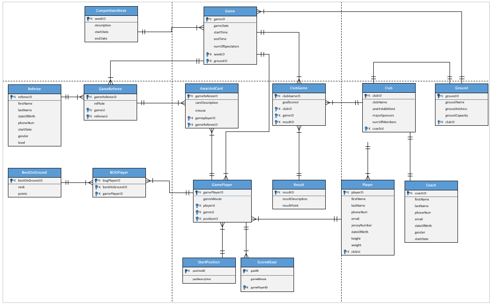

# ⚽ Soccer Competition Database

A relational database for a soccer competition, designed and implemented in **Oracle SQL**. The project takes a real-world scenario (clubs, players, games, referees, goals, cards, and awards) and turns it into a normalised 16-table database with full DDL, sample data, and analytical queries that answer practical business questions.

Built for **ISYS5000 Database** at Curtin University as a group project (Group 13). My contribution is described below.

---

---

## 🗺️ Entity-Relationship Diagram

The schema has **16 tables** linked by 18 documented business rules. A central `Game` connects to clubs (via `ClubGame`), players (via `GamePlayer`), and referees (via `GameReferee`). From each player's appearance, the model branches into goals (`ScoredGoal`), disciplinary cards (`AwardedCard`), starting positions (`StartPosition`), and best-on-ground awards (`BOGPlayer` → `BestOnGround`). Substitutions are captured within `GamePlayer` (via `gameMinute` and the "Substitute" start position) rather than in a separate table.

---

## 🔧 Revised After Feedback

This repository is a **revised version** that incorporates the marker's feedback on the original submission:

- **Removed the `Substitution` table.** It created an unresolved many-to-many (two foreign keys into `GamePlayer` from the same parent). Substitutions are instead captured within `GamePlayer` using `gameMinute` and the "Substitute" start position, which is the cleaner relational approach.
- **Corrected business rules.** The `Club`–`Ground` relationship now reads as training/ownership ("A Club trains at one and only one Ground") rather than where games are played, and the `GamePlayer`–`ScoredGoal` descriptor was fixed.
- **Added `numOfSpectators`** to the `Game` entity in the ERD and schema (previously only added via a later `UPDATE`).

The original submission scored 74.85%. These are the corrections the marker noted would have lifted it to 80%+.

---

## 🧩 What This Project Covers

1. **Conceptual design** — an ERD with 18 business rules capturing how clubs, games, players, referees, goals, cards, and awards relate
2. **Logical schema** — a 16-table relational schema with primary and foreign keys, normalised to remove redundancy
3. **Physical implementation** — Oracle DDL to create every table, plus sample data for the full competition
4. **Analysis** — SQL queries that answer real business questions about the season

---

## ⭐ The Analytical Queries

The most interesting part of the project. These queries use **joins, aggregation (SUM, COUNT), subqueries, HAVING, and LEFT JOINs** to answer questions a competition organiser would actually ask:

- **Season ladder** — total competition points per club (result points + best-on-ground points), with goals and home/away wins
- **Club summary** — each club's full home/away win-loss-draw record
- **Top goal scorers** — players ranked by goals across the season
- **Top scorer's goals** — every goal by the leading scorer, with opponent and ground (uses a `HAVING` subquery to find the maximum)
- **Goals per ground** — average goals per game at each ground (a `LEFT JOIN` keeps goalless games in the average)
- **Best-on-Ground (MVP)** — players ranked by BoG points, with a breakdown of 3/2/1-point awards
- **Away form** — each club's away wins, draws, and losses

See [`sql/03_analytical_queries.sql`](sql/03_analytical_queries.sql).

---

## 📁 Repository Contents

- `sql/01_create_tables.sql` — Oracle DDL: all 16 tables with PK/FK constraints
- `sql/02_insert_data.sql` — sample data for the full competition (Oracle `INSERT ALL`)
- `sql/03_analytical_queries.sql` — the analytical business-question queries
- `images/erd.png` — the entity-relationship diagram
- `docs/business-rules.md` — the 18 revised business rules
- `docs/soccer-database-report.pdf` — the full original design report (ERD, business rules, data dictionary, query explanations)

---

## ▶️ How to Run

In an Oracle environment (e.g. SQL Developer or Oracle Live SQL), run the scripts in order:
1. `sql/01_create_tables.sql` — creates the schema
2. `sql/02_insert_data.sql` — loads the sample data
3. `sql/03_analytical_queries.sql` — run any query to see the analysis

---

## 👥 Team & My Contribution

This was a group project for ISYS5000 (Group 13: Waranyu Bancherdvanich, Farhan Bhuiyan, Thinley Dorji). The work spanned conceptual design (ERD and business rules), the logical schema and normalisation, the Oracle DDL and data, and the analytical queries. I contributed across the design, schema, and SQL implementation.

---

## 📊 What This Demonstrates

- Translating a real-world scenario into a normalised relational schema
- Designing an ERD with clearly documented business rules and cardinalities
- Writing clean Oracle DDL with proper primary and foreign key constraints
- Writing non-trivial analytical SQL (joins, aggregation, subqueries, HAVING) to answer business questions

---

## 📫 Author

**Waranyu (JO) Bancherdvanich** — [LinkedIn](https://www.linkedin.com/in/waranyu-ban) · [GitHub](https://github.com/jo-bancherdvanich)
