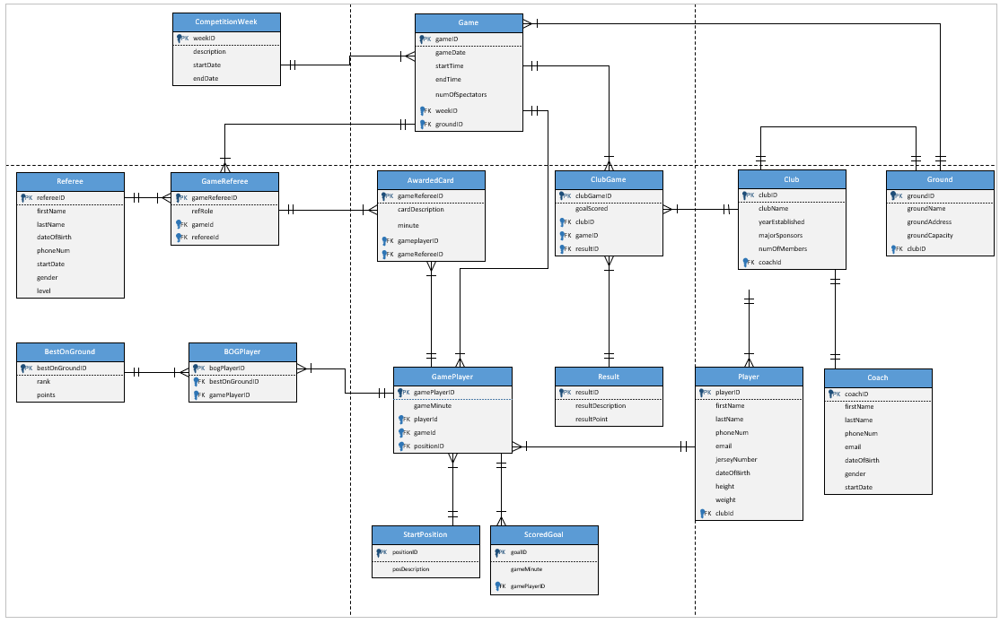

# ⚽ Soccer Competition Database

A relational database for a soccer competition, designed and implemented in **Oracle SQL**. The project takes a real-world scenario (clubs, players, games, referees, goals, cards, and awards) and turns it into a normalised 16-table database with full DDL, sample data, and analytical queries that answer practical business questions.

Built for **ISYS5000 Database** at Curtin University as a group project (Group 13). My contribution is described below.

---

---

## 🗺️ Entity-Relationship Diagram

The schema has **16 tables** linked by 18 documented business rules. A central `Game` connects to clubs (via `ClubGame`), players (via `GamePlayer`), and referees (via `GameReferee`). From each player's appearance, the model branches into goals (`ScoredGoal`), disciplinary cards (`AwardedCard`), starting positions (`StartPosition`), and best-on-ground awards (`BOGPlayer` → `BestOnGround`). Substitutions are captured within `GamePlayer` (via `gameMinute` and the "Substitute" start position) rather than in a separate table.

📖 **Read the documentation on GitHub — no download needed:**

| | |
|---|---|
| 🗺️ **[Entity-Relationship Diagram](docs/erd.md)** | The model, how it is shaped, and why |
| 📋 **[Business Rules](docs/business-rules.md)** | All 18 rules with cardinalities |
| 📖 **[Data Dictionary](docs/data-dictionary.md)** | Every table, column, type and constraint |
| ⭐ **[Analytical Queries](docs/queries.md)** | All 9 queries explained, **with real results** |

*The full design report is also here as a [PDF](docs/soccer-database-report.pdf).*

---

## 🔧 Design Decisions Worth Noting

- **No `Substitution` table.** A dedicated table would need two foreign keys into `GamePlayer` from the same parent, creating an unresolved many-to-many. Substitutions are instead captured within `GamePlayer` using `gameMinute` and the "Substitute" start position — the cleaner relational approach, and it loses no information.
- **`Club`–`Ground` is training and ownership,** not where games are played. A club trains at one and only one ground; a game is played *at* a ground, which is how the queries work out who was at home.
- **`numOfSpectators` sits on the `Game` entity** in both the ERD and the schema, rather than being applied later by an `UPDATE`.

---

## 🧩 What This Project Covers

1. **Conceptual design** — an ERD with 18 business rules capturing how clubs, games, players, referees, goals, cards, and awards relate
2. **Logical schema** — a 16-table relational schema with primary and foreign keys, normalised to remove redundancy
3. **Physical implementation** — Oracle DDL to create every table, plus sample data for the full competition
4. **Analysis** — SQL queries that answer real business questions about the season

---

## ⭐ The Analytical Queries

The most interesting part of the project. These queries use **joins, aggregation (SUM, COUNT), subqueries, HAVING, and LEFT JOINs** to answer questions a competition organiser would actually ask:

- **Season ladder** — total competition points per club (result points + best-on-ground points), with goals and home/away wins
- **Club summary** — each club's full home/away win-loss-draw record
- **Top goal scorers** — players ranked by goals across the season
- **Top scorer's goals** — every goal by the leading scorer, with opponent and ground (uses a `HAVING` subquery to find the maximum)
- **Goals per ground** — average goals per game at each ground (a `LEFT JOIN` keeps goalless games in the average)
- **Best-on-Ground (MVP)** — players ranked by BoG points, with a breakdown of 3/2/1-point awards
- **Away form** — each club's away wins, draws, and losses

See [`sql/03_analytical_queries.sql`](sql/03_analytical_queries.sql).

---

## 📁 Repository Contents

- `sql/01_create_tables.sql` — Oracle DDL: all 16 tables with PK/FK constraints
- `sql/02_insert_data.sql` — sample data: a complete 8-club, 14-round season (2,227 rows)
- `sql/03_analytical_queries.sql` — the nine analytical business-question queries
- `docs/erd.md` — the ERD and how the model is shaped
- `docs/business-rules.md` — the 18 revised business rules
- `docs/data-dictionary.md` — every table, column, type and constraint
- `docs/queries.md` — the queries explained, with real output
- `images/erd.png` — the entity-relationship diagram
- `docs/soccer-database-report.pdf` — the design report as a PDF

---

## ▶️ How to Run

In an Oracle environment (e.g. SQL Developer or Oracle Live SQL), run the scripts in order:
1. `sql/01_create_tables.sql` — creates the 16 tables
2. `sql/02_insert_data.sql` — loads the season
3. `sql/03_analytical_queries.sql` — run any query to see the analysis

The script set is verified end to end: all 16 tables create, all **2,227 rows load with no
foreign key violations**, and all nine queries return results. See
[`docs/queries.md`](docs/queries.md) for what each one produces.

### About the sample data

The clubs, coaches, grounds, referees, competition weeks, start positions and result types are
the original reference data for this fictional Busselton-region competition. The fixture data —
the 56-game double round robin, and the appearances, goals, cards and best-on-ground awards that
hang off it — is generated deterministically so the season is complete and internally consistent:
8 clubs, 12 players each, 14 rounds, every club playing every other club home and away exactly
once.

---

## 👥 Team & My Contribution

This was a group project for ISYS5000 (Group 13: Waranyu Bancherdvanich, Farhan Bhuiyan, Thinley Dorji). The work spanned conceptual design (ERD and business rules), the logical schema and normalisation, the Oracle DDL and data, and the analytical queries. I contributed across the design, schema, and SQL implementation.

---

## 📊 What This Demonstrates

- Translating a real-world scenario into a normalised relational schema
- Designing an ERD with clearly documented business rules and cardinalities
- Writing clean Oracle DDL with proper primary and foreign key constraints
- Writing non-trivial analytical SQL (joins, aggregation, subqueries, HAVING) to answer business questions

---

## 📫 Author

**Waranyu (JO) Bancherdvanich** — [Portfolio](https://jo-bancherdvanich.github.io/waranyu-CV/) · [LinkedIn](https://www.linkedin.com/in/waranyu-ban) · [GitHub](https://github.com/jo-bancherdvanich)
