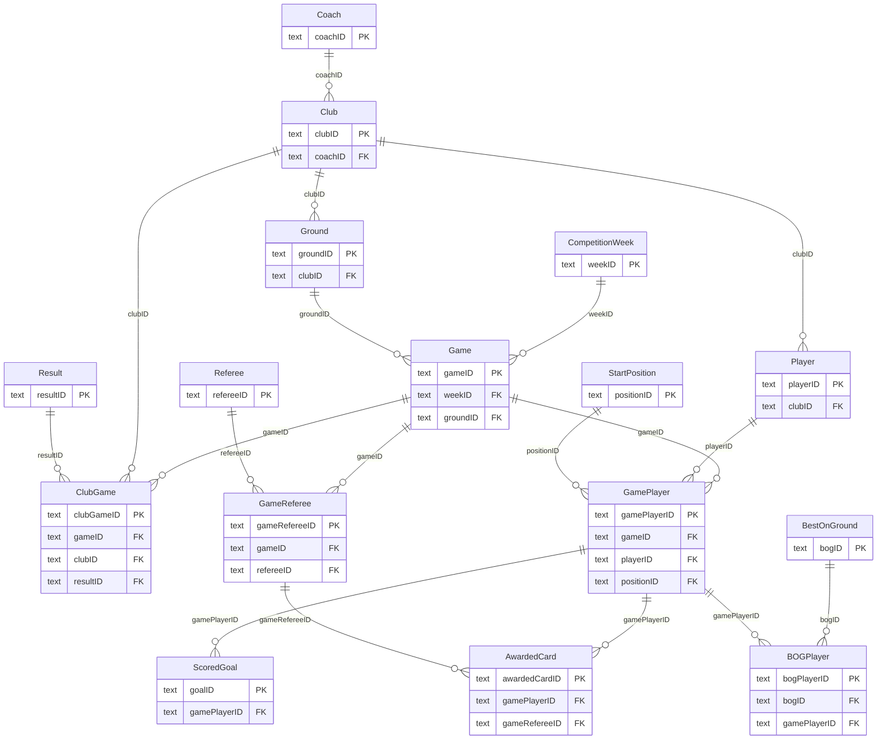

# Entity-Relationship Diagram

The conceptual design of the competition database: **16 tables** linked by
**18 business rules**, which are documented separately in
[`business-rules.md`](business-rules.md).

---

## The diagram from the design report

*The ERD as submitted, showing all 16 entities with their attributes and cardinalities.*

---

## The same model, rendered from the DDL

This diagram is generated from the foreign keys actually declared in
[`sql/01_create_tables.sql`](../sql/01_create_tables.sql), so it shows the schema as it is
really built rather than as it was drawn. Only keys are shown, to keep it readable.

---

## How the model is shaped

**A central `Game`.** Every game belongs to one `CompetitionWeek` and is played at one `Ground`.
From there the model fans out through three junction tables:

| Junction | Connects | Grain |
|---|---|---|
| `ClubGame` | `Game` ↔ `Club` | One row per club per game — its goals and result |
| `GameReferee` | `Game` ↔ `Referee` | One row per official appointed to a game |
| `GamePlayer` | `Game` ↔ `Player` | One row per player appearance |

**Everything that happens to a player hangs off `GamePlayer`,** not off `Player`. That is the
key modelling decision: a goal, a card or a best-on-ground award belongs to a specific
appearance in a specific game, so `ScoredGoal`, `AwardedCard` and `BOGPlayer` all reference
`gamePlayerID`. This is what makes questions like "every goal by the leading scorer, with the
opponent and the ground" answerable in a single join path.

**Substitutions have no table of their own.** A substitute is a `GamePlayer` row whose
`positionID` is `SP12` ("Substitute") and whose `gameMinute` is less than 90. A dedicated
`Substitution` table would need two foreign keys into `GamePlayer` from the same parent, creating
an unresolved many-to-many. Capturing it within `GamePlayer` is the cleaner relational answer and
loses no information.

**`Club` and `Ground` are one-to-one.** A club trains at exactly one ground and a ground
belongs to exactly one club. A game is played at *a* ground, which is how the queries work out
who was at home: the home club is the one whose `clubID` matches the ground's.
